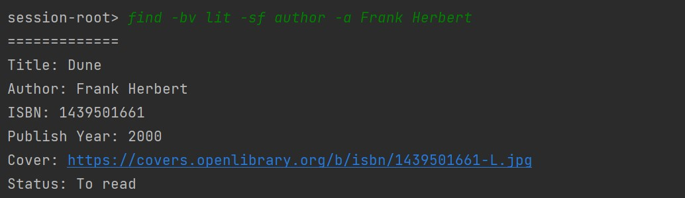
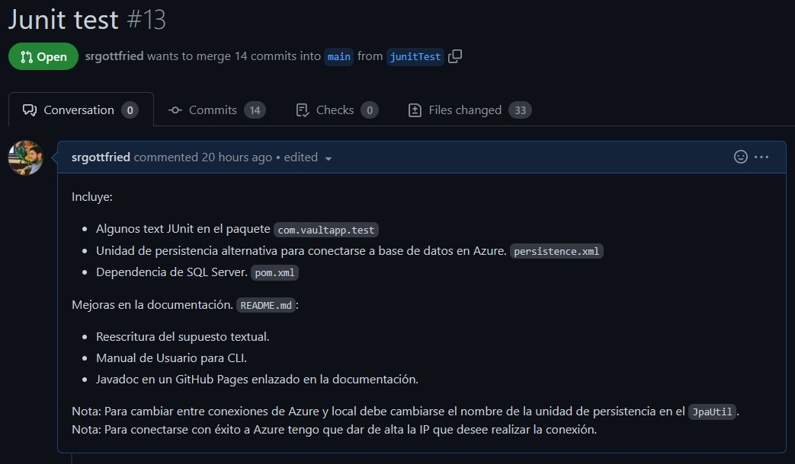

# Proyecto UD3 - Hibernate

<!-- TOC -->
* [Proyecto UD3 - Hibernate](#proyecto-ud3---hibernate)
  * [Participantes](#participantes)
  * [Supuesto textual](#supuesto-textual)
  * [APIs utilizadas](#apis-utilizadas)
    * [Open Library Search API](#open-library-search-api)
    * [Open Library Covers API](#open-library-covers-api)
    * [The Movie Data Base (TMDB)](#the-movie-data-base--tmdb-)
      * [Endpoints](#endpoints)
  * [Manual Técnico](#manual-técnico)
    * [Estructura de paquetes](#estructura-de-paquetes)
    * [Diagrama de clases](#diagrama-de-clases)
    * [Diagrama ER](#diagrama-er)
    * [Diagrama de persistencia](#diagrama-de-persistencia)
  * [Manual de usuario para CLI](#manual-de-usuario-para-cli)
      * [1. Inicio de sesión](#1-inicio-de-sesión)
      * [2. Status](#2-status)
      * [3. Crear un nuevo Vault](#3-crear-un-nuevo-vault)
      * [4. Buscar y añadir un nuevo elemento a un vault](#4-buscar-y-añadir-un-nuevo-elemento-a-un-vault)
      * [5. Abrir y visualizar el contenido de un vault](#5-abrir-y-visualizar-el-contenido-de-un-vault)
      * [6. Buscar por criterios dentro de un vault](#6-buscar-por-criterios-dentro-de-un-vault)
      * [7. Borrar un libro o película](#7-borrar-un-libro-o-película)
      * [8. Borrar un vault](#8-borrar-un-vault)
      * [9. Cerrar sesión de usuario](#9-cerrar-sesión-de-usuario)
      * [10. Cerrar la aplicación](#10-cerrar-la-aplicación)
    * [Lista detallada de comandos para CLI](#lista-detallada-de-comandos-para-cli)
  * [Manual de usuario para GUI](#manual-de-usuario-para-gui)
  * [Requisitos de codificación](#requisitos-de-codificación)
  * [GIT](#git)
    * [Lista de pull requests cerradas](#lista-de-pull-requests-cerradas)
    * [Pull request relevantes](#pull-request-relevantes)
  * [Propuestas de mejora](#propuestas-de-mejora)
  * [Reparto de las tareas](#reparto-de-las-tareas)
  * [Opinión](#opinión)
<!-- TOC -->

## Participantes

- Manuel Landín Gómez
- Sergio Alonso Pazo

## Supuesto textual

Se queire contruir una aplicación que permita a sus usuarios
almacenar listas con sus libros y películas favoritos.
Para ello un usuario puede crear distintos *vaults* o almacenes donde
guardar sus listas.

* Un usuario puede iniciar sesión en la app, recuperando la configuración de su perfil y *vaults* creados.
* Un *vault* puede almacenar una lista de libros o de películas, pero no ambos.
  Además un usuario podrá crear una cantidad de *vaults* arbitraria. De esta manera,
  un usuario dispondá de dos listas de *vaults* independientes, una con sus
  *vaults* de libros y otra con sus *vaults* de películas.

Los datos de libros y películas serán buscados a través de la aplicación, pudiendo ser
incluidos en los vaults que el usuario desee.
Además, los datos almacenados se mostrarán al usuario,
pudiendo ser modificados, o eliminados a placer.

Toda la información estará almacenada de manera persistente en una base de datos, admitiendo
dos modalidades:

- Sistema gestor MySQL en local.
- Sistema gestor SQL Server en Azure.

La aplicación podrá ser lanzada en dos modos: CLI y GUI.


## APIs utilizadas

### Open Library Search API

API REST aberta que proporciona datos relativos a libros publicados.

### Open Library Covers API

API REST aberta que proporciona acceso a las portadas de libros y las fotos de autor disponibles en el repositorio de
portadas de la biblioteca abierta.

### The Movie Data Base (TMDB)

API REST que proporciona datos sobre películas e series.  
API key: 19ccdf01a305d5f5c3485958c90ef5d6

**Para conseguir a imaxe do póster dunha película**:  
`https://image.tmdb.org/t/p/original/<poster_path>`

#### Endpoints

- **/search/movie**
  **Formato da query**: `https://api.themoviedb.org/3/search/movie?api_key=<api_key>&query=<query>`
  Poden engadirse filtros de busca opcionais.
- **/movie/**  
  **Formato da query**: `https://api.themoviedb.org/3/movie/<movie_id>?api_key=<api_key>`
  Devolve un único obxecto `Film` segundo o _movie\_id_ empregado.

## Manual Técnico

### Estructura de paquetes

A continuación se describe la estructura general del proyecto. Para una información más precisa
acerca de la estructura, descripción de clases, y funcionalidades consulte
el [Javadoc](https://srgottfried.github.io/vaultApp_documentation/index.html) de la aplicación.

- `com.vaultapp`
    - `controller` Contiene las clases controladoras principales del proyecto. Aquí se desarrolla la lógica de negocio.
    - `login` Contiene la clase de gestión de sesiones de usuario.
    - `model`
        - `entities` Contiene a las clases de entidad o modelos principales del proyecto.
            - `dao` Contiene el conjunto de implementaciones de acceso a datos para los modelos.
        - `pojo` Contiene la estructura necesaria para el adecuado volcado de datos desde las distintas APIs empleadas.
        - `repository` Contiene las clases de gestión de datos. Este paquete actúa como una capa superior de abstracción
          del paquete DAO, que permite tratar a los datos virtualmente como colecciones de Java.
    - `tests` Contiene los test unitarios necesarios durante el desarrollo.
    - `utilities` Contiene algunas clases de utilidad, como un gestor de conexión o una clase para el cifrado de datos.
        - `filters` Contiene los filtros de búsqueda válidos.
    - `view` Contiene las vistas del proyecto.

### Diagrama de clases

A continuación se expone el diagrama de clases empleado en la resolución del
supuesto textual.


### Diagrama ER

La aplicación cuenta con dos bases de datos operativas,
una en entorno local y otra en la nube de Azure.
A continuación se expone el diagrama ER empleado:


### Diagrama de persistencia

Para el desarrollo del proyecto se ha hecho uso del ORM Hibernate. A continuación
se muestra el esquema de persistencia que se ha empleado en la resolución del supuesto:


## Manual de usuario para CLI

La experiencia de usuario por interfaz de línea de comandos es una experiencia sencilla y funcional
que no debe asustar al público inexperto. En los puntos sucesivos, indicaremos el funcionamiento
básico de la aplicación, haciendo uso de la totalidad de los sencillos comandos que el usuario pueda
requerir.

#### 1. Inicio de sesión

Tan pronto como el programa se encuentre en ejecución, un prompt triangular se mostrará en la
parte izquierda del terminal. Nuestro primer paso será iniciar sesión. Para ello es suficiente
con escribir el comando `login -u USUARIO -p CONTRASEÑA` tal y como se muestra en la siguiente imagen:


El sistema nos dará la bienvenida. El prompt se actualizará para visualizar el usuario que se encuetra
manejando la sesión.

#### 2. Status

Lo primero que podemos hacer al inicar sesión es visualizar nuestro estado de sesión a través del
comando `status`:


El sistema nos mostrará información sobre:

- Nuestro nombre de usuario.
- Nuestra última fecha y hora de conexión.
- Nuestras listas, tanto de libros (BookVaults) como de películas (FilmVaults).

#### 3. Crear un nuevo Vault

Esta es una aplicación de crear colecciones de libros y películas, y para ello nos apoyamos en
el concepto de **Vault**. Un **vault** es un simple contenedor, que almacenará una lista de libros
o películas. Podremos crear tantos vaults como queramos, y se almacenarán a su vez en dos listas
independientes según el tipo de vault.
BookVaults será la lista de vaults de libros, y FilmVaults la lista de vaults de películas.

Por ahora no contamos con ningún vault. Para crear un nuevo vault de libros hacemos uso del comando
`create -bv NOMBRE_DEL_VAULT` tal y como se muestra en la siguiente imagen:


Una vez creado el vault, se mostrará en su lista correspondiente. De forma análoga podemos crear
un vault de películas a través del comando `create -fv NOMBRE_DEL_VAULT`:


#### 4. Buscar y añadir un nuevo elemento a un vault

Como vemos en las imágenes, cada nuevo vault creado va acompañado de un número entre paréntesis.
Este número indica la cantidad de libros o películas que dicho vault tiene en su interior. Como
ambos vaults, Literature y Comedy, están recién creados, no contienen ningún elemento.

Para añadir elementos a nuestros vaults tenemos que seguir un simple proceso:

1. Hacemos uso del buscador integrado en la aplicación para encontrar el elemento deseado. Para ello
   es suficiente con escribir el comando `search -b TÍTULO` para libros o `search -f TÍTULO`para
   películas. El programa nos mostrará una lista relativamente amplia de resultados obtenidos de
   distintas APIs de uso libre:
   
2. Una vez encontrada la versión que más nos guste, copiamos el ISBN (para libros) o TMID (para películas)
   y lo usamos para añadir dicha versión a nuestro vault:
   
   Ahora el contador del vault Literature se muestra a 1.

Podemos repetir el
proceso de añadir libros o películas tantas veces como queramos.
En el caso de ejemplo, podemos construir una colección de libros
encapsulada en nuestro vault Literature tan grande como se desee:


#### 5. Abrir y visualizar el contenido de un vault

Para visualziar el contenido de un vault es tan sencillo como escribir
el comando `open -bv NOMBRE` para un vault de libros y
`open -fv NOMBER` para un vault de películas.


El sistema nos mostrará el contenido completo del vault, con nuestra lista de libros o películas
favoritas.

Además de la información habitual, se añade el atributo *Status* para indicar si aún no hemos
empezado a leer el libro (*to read*) o ya lo hemos terminado (*finish*). Un atributo análogo
se muestra en las listas de películas.

Para cambiar el valor de este atributo es tan sencillo como escribir el comando
`chsts --isbn ISBN -v NOMBRE_DEL_VAULT`, tal y como se muestra en la siguiente imagen:


#### 6. Buscar por criterios dentro de un vault

Cuando las listas se hacen grandes, resulta muy útil buscar elementos de dicha lista
usando criterios de búsqueda definidos por el propio usuario. Para ello, podemos hacer uso
del comando `find -bv NOMBRE_DEL_VAULT -sf FILTRO -a BÚSQUEDA` tal y como se muestra en las
siguientes imágenes:

- Buscando por ISBN:
  
- Buscando por autor:
- 
- Buscando por título:
- 

#### 7. Borrar un libro o película

Si pensamos que un libro o película ya no debiera estar en nuestra lista, podemos borrarla
del vault con el comando `delete -b --isbn ISBN -v NOMBRE_DEL_VAULT` en el caso de un libro
o `delete -f --tmid TMID -v NOMBRE_DEL_VAULT` en el caso de una película.

En el siguiente ejemplo procedemos a borrar el libro de Dune que teníamos en nuestro
vault de libros Literature:


#### 8. Borrar un vault

También resulta posible borrar un vault directamente si nos hemos cansado de él.
Para ello recurrimos al comando `delete -bv NOMBRE_DEL_VAULT` para un vault de libros
o `delete -fv NOMBRE_DEL_VAULT` para un vault de películas.

En el siguiente ejemplo procedemos a borrar el vault Literature (!con libros dentro!):


#### 9. Cerrar sesión de usuario

Para cerrar nuestra sesión y que nadie toquetee nuestros vaults favoritos, hacemos uso
del comando `logout`. El programa seguirá en ejecución, pero nuestra sesión se habrá cerrado
con éxito.


#### 10. Cerrar la aplicación

Si ningún otro usuario va a hacer uso de la aplicación en el corto plazo, podemos
parar su ejecución a través del comando `exit`:


### Lista detallada de comandos para CLI

- Comandos para la gestión de la sesión:
    - `login [-u|--user] USER [-p|--password] PASSWORD` Inica sesión de usuario.
    - `logout` Cierra sesión de usuario.
    - `status` Muestra información general sobre el usuario y sus colecciones de vaults.
    - `exit` Cierra sesión y sale del programa.


- Comandos para la gestion de vaults:
    - `create [-bv|-fv|--bookvault|--filmvault] NAME` Crea un vault vacío con nombre.
    - `open [-bv|-fv|--bookvault|--filmvault] NAME` Abre y muestra un vault por nombre. El vault debe existis
      previamente en una colección del usuario.
    - `delete [-bv|-fv|--bookvault|--filmvault] NAME` Borra un vault por nombre.


- Comandos para gestión de libros y películas
    - `search [-b|-f|--book|--film] NAME` Busca un libro por título en API Open Library.
    - `add [-b|--book] --isbn ISBN [-v|--vault] VAULT_NAME` Añade el libro de ISBN dado en el vault de nombre dado.
    - `add [-f|--film] --tmid TMID [-v|--vault] VAULT_NAME` Añade la película de TMID dado en el vault de nombre dado.
    - `find [-bv|-fv|--bookvault|--filmvault] VAULT_NAME [-sf|--filter] FILTER [-a|--arg] ARGUMENT`Realiza una búsqueda
      sobre un vault bajo un criterio de búsqueda prporcionado por el usuario.
    - `chsts --isbn ISBN [-v|--vault] VAULT_NAME` Cambia el estado de un libro.
    - `chsts --tmid TMID [-v|--vault] VAULT_NAME` Cambia el estado de una película.
    - `delete [-b|--book] --isbn ISBN [-v|--vault] VAULT_NAME` Borra el libro de ISBN dado en el vault de nombre dado.
    - `delete [-f|--film] --tmid TMID [-v|--vault] VAULT_NAME` Borra la película de TMID dado en el vault de nombre
      dado.

## Manual de usuario para GUI

### Inicio de sesión


La pantalla inicial que se muestra al abrir la aplicación. Los usuarios inician sesión introduciendo sus credenciales en
los campos designados para ello:

1. Nombre de usuario
2. Contraseña de usuario

El elemento 3 es el botón que permite al usuario iniciar sesión.

### Gestión de _vaults_


1. Campo para el nombre del vault seleccionado. En caso de no haberlo se muestra un mensaje explicativo.
2. _Toggle_ para expandir el menú lateral
3. Abrir el diálogo de elección de vaults de películas
4. Abrir el diálogo de elección de vaults de libros
5. Añadir un elemento al vault actual
6. Finalizar la sesión actual


Error resultante de intentar añadir un elemento sin seleccionar un vault.


Mensaje mostrado al iniciar el cierre de sesión.


El menú lateral muestra información aclarativa sobre la función de cada control al expandirse.


Al pulsar los botones de la vista principal correspondientes, se inicia un diálogo para seleccionar o crear un nuevo vault.

1. Tabla que muestra el listado de vaults
2. Selecciona el vault resaltado en la tabla para operar con él
3. Crea un nuevo vault de películas o libros según el botón usado para iniciar el diálogo
4. Vuelve a la vista principal
5. Borra el vault resaltado


Al crear un vault, se propondrá al usuario que le dé un nombre.


Diálogo de confirmación al añadir un elemento al vault seleccionado tras buscarlo usando el campo de texto y el botón
search.


Vista principal mostrando los datos de un vault.

1. Nombre del usuario y el vault seleccionado
2. Datos básicos de un elemento
3. Vista de detalle
4. Información sobre el elemento
5. Control de cambio de estado del elemento
6. Botón de eliminación del elemento

## Requisitos de codificación

- [CRUD para 3 de las entidades principales.](https://srgottfried.github.io/vaultApp_documentation/com/vaultapp/model/entities/dao/package-summary.html)

- 5 Consultas Query en JPSQL de interés de acuerdo al supuesto y donde el usuario podrá especificar parámetros de la
  búsqueda:

````java
/**
 * Returns a list of books that match the given filter and search argument.
 * Only books belonging to the given user will be considered.
 *
 * @param user the user whose books should be considered
 * @param filter the filter to apply
 * @param arg the search argument
 * @return the list of matching books
 */
public List<Book> findBy(User user,BookFilter filter,String arg){
        Query q;

        if(filter==BookFilter.TITLE){
        q=em.createQuery("select b from Book b join User u where u = :user and b.title = :title");
        q.setParameter("title",arg);
        q.setParameter("user",user);
        }else if(filter==BookFilter.AUTHOR){
        q=em.createQuery("select b from Book b join User u where u = :user and  b.author = :author");
        q.setParameter("author",arg);
        q.setParameter("user",user);
        }else if(filter==BookFilter.ISBN){
        q=em.createQuery("select b from Book b join User u where u = :user and  b.isbn = :isbn");
        q.setParameter("isbn",arg);
        q.setParameter("user",user);
        }else{
        return null;
        }

        try{
        return(List<Book>)q.getResultList();

        }catch(Exception e){
        return null;
        }
        }
````

````java
/**
 * Finds Film objects in the database that match the given search criteria.
 *
 * @param user the User object to search for Films belonging to
 * @param filter the FilmFilter to use for searching
 * @param arg the search argument to use
 * @return a List of Film objects matching the search criteria, or null if no Films were found
 */
public List<Film> findBy(User user,FilmFilter filter,String arg){
        Query q;

        if(filter==FilmFilter.TITLE){
        q=em.createQuery("select f from Film f join User u where u = :user and f.title = :title");
        q.setParameter("title",arg);
        q.setParameter("user",user);
        }else if(filter==FilmFilter.TMID){
        q=em.createQuery("select f from Film f join User u where u = :user and f.tmdbId = :tmid");
        q.setParameter("tmid",arg);
        q.setParameter("user",user);
        }else{
        return null;
        }

        try{
        return(List<Film>)q.getResultList();
        }catch(Exception e){
        return null;
        }
        }
````

````java
/**
 * Finds a user with a specific name.
 * @param name the name of the user to find
 * @return the user with the specified name, or null if no such user exists
 */
public User find(String name){
        Query q=em.createQuery("select u from User u where name = :name");
        q.setParameter("name",name);
        try{
        return(User)q.getSingleResult();
        }catch(Exception e){
        return null;
        }
        }
````

- Salir: Se le deberá mostrar un mensaje de despedida al usuario:
  

## GIT

Puede consultarse el proyecto en el repositorio de GitHub:
https://github.com/CGAInstitution/proyecto-ud3-sergio-y-manuel.git

### Lista de pull requests cerradas


### Pull request relevantes





## Propuestas de mejora

- Incluir nuevos tipos de vaults, para almacenar elementos como videojuegos, cómics,
  cartas, etc.
- Implementar un sistema de registro completo.
- Incluir campos de valoración y opinión de los elementos consumidos por el usuario.
- Incluir formas de interacción entre usuarios.
- Sistema de importación/exportación de colecciones a distintos formatos.
